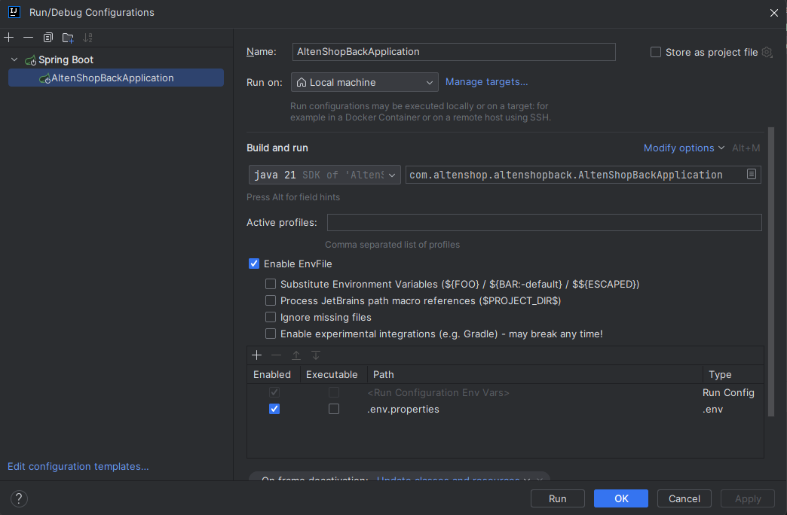

# AltenShopBack

Création d'une API pour AltenShop

## Pré-requis

### Base de donnés

Pour pouvoir stocker les Produits crées, il vous faudra créer une Base de données. Dans notre cas, il est recommandé de créer une BDD MySQL.

### Variables d'environnement

Afin de pouvoir exécuter l'application, il vous faudra créer un fichier *.env.properties*.

Voici un exemple des données présentes dans ce fichier :

```
DATABASE_URL=votre_adresse_db
DATABASE_PASSWORD=votre_password
DATABASE_USER=votre_user
```
Ces informations seront lu au lancement de l'application.

## Installation

L'outil de gestion des dépendances est Maven.

Pour installer celles-ci, lancer :

```bash
mvn clean install
```

Ceci installera les dépendances présentes dans le *pom.xml*

Pour lancer le projet : deux possibilités :

* Soit vous passez par maven via cette commande :

```bash
mvn spring-boot:run
```

* Deuxième option, vous posséder un IDE (*Ex : IntelliJ*) capable de le lancer pour vous. Voici un exemple de Configuration de lancement :



